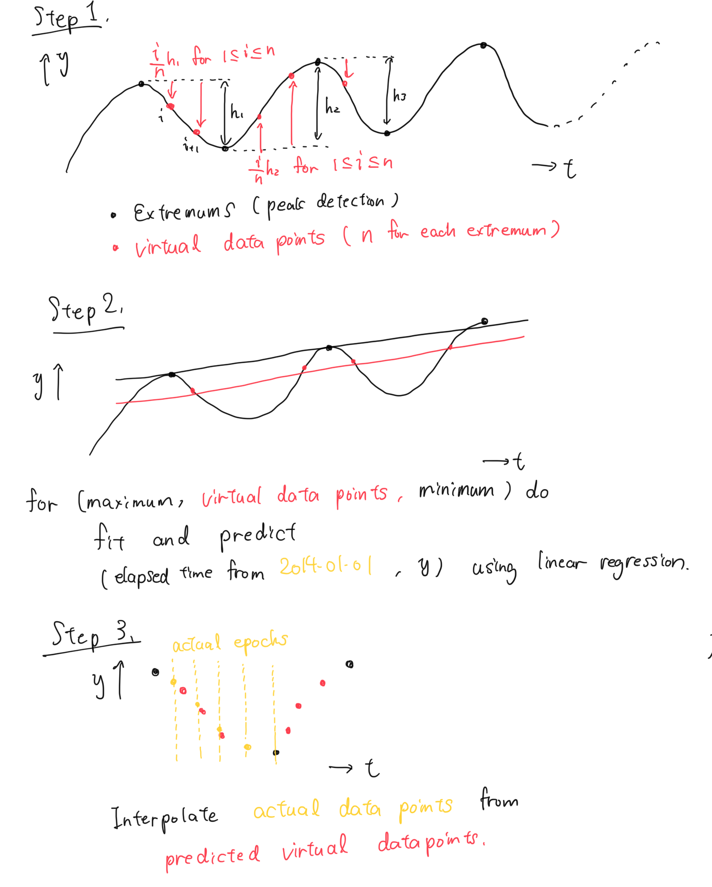

# IDAO 2020 online roud
**Team: QuMantumPhysicists**

## Directory
```
.
├── input/
  ├── train.csv
  └── Track 1
    └── test.csv
├── requirements.txt
├── Makefile
├── README.md
├── model_description.PNG
├── fit_param_dictAA.dump
├── fit_param_dictB2.dump 
├── lr_hyperparam.csv
├── main.sh
├── trackA_predict.py
├── trackB_predict.py
└── train.py

```

* common
  - `input/`
    - input data folder from https://disk.yandex.ru/d/0zYx00gSraxZ3w
  - `requirements.txt`
    - development environment
  - `train.py`
    - fit by linear regression and save results
    - generate `fit_param_dictAA.dump` and `fit_param_dictB2.dump`
  - `lr_hyperparam.csv`
    - list of hyper parameters
* for track A
  - `fit_param_dictAA.dump`
  - `trackA_predict.py`
    - make prediction
* for track B
  - `fit_param_dictB2.dump`
  - `trackB_predict.py`
    - make prediction
  - `Makefile`
  - `main.sh`

<hr>

## Instructions
1. Place input data in `input/` (shown in Directory section).
2. If necessary, install packages in `requirements.txt`.
3. Train models for both tracks:  `python train.py`.
    - Pretrained models(`fit_param_dictAA.dump` and `fit_param_dictB2.dump`) will be generated.
    - It takes **around 1 hour** with 4 cores.

### for track A:
4. Make submission: `python trackA_predict.py`.
    - `submission_trackA.csv` will be generated.

### for track B:
4. Zip current working directory.

<hr>

## Model description
*All you need is linear regression*

